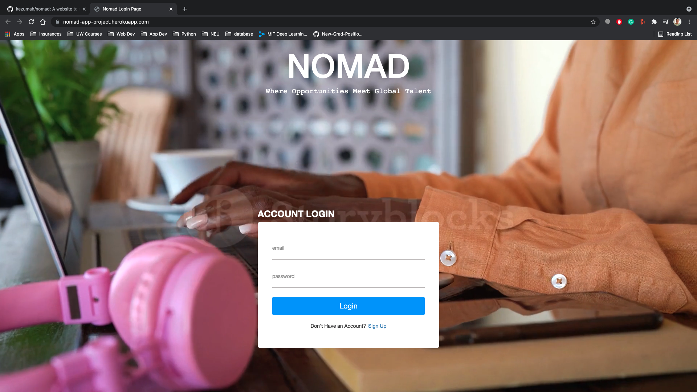
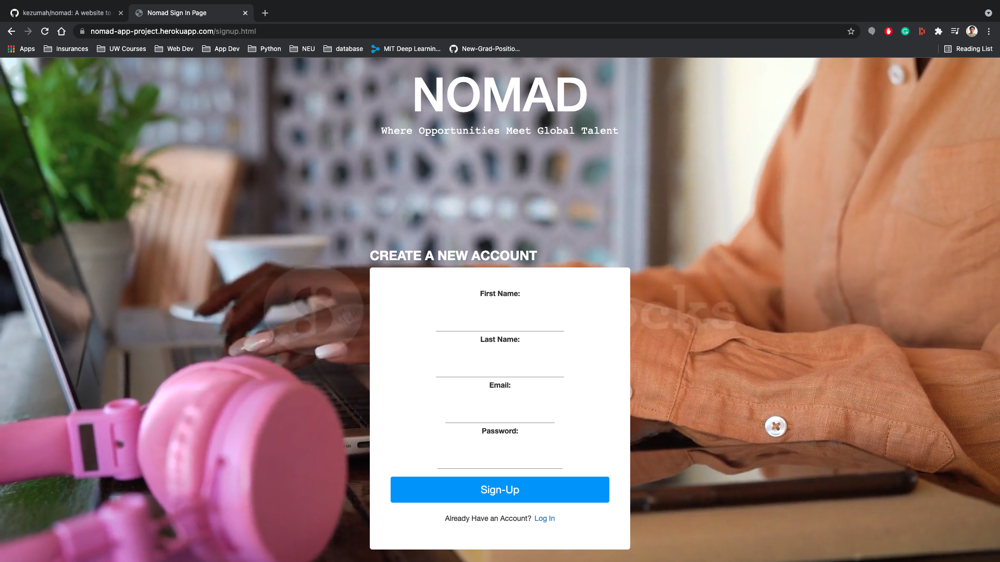
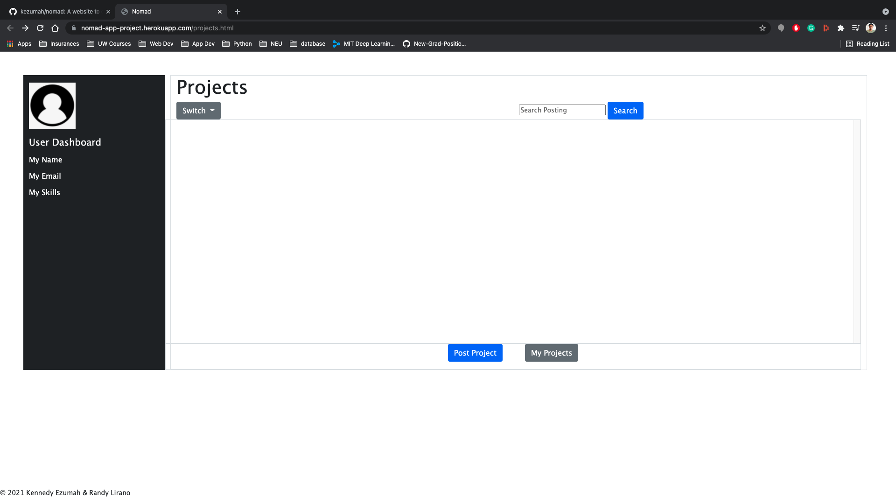
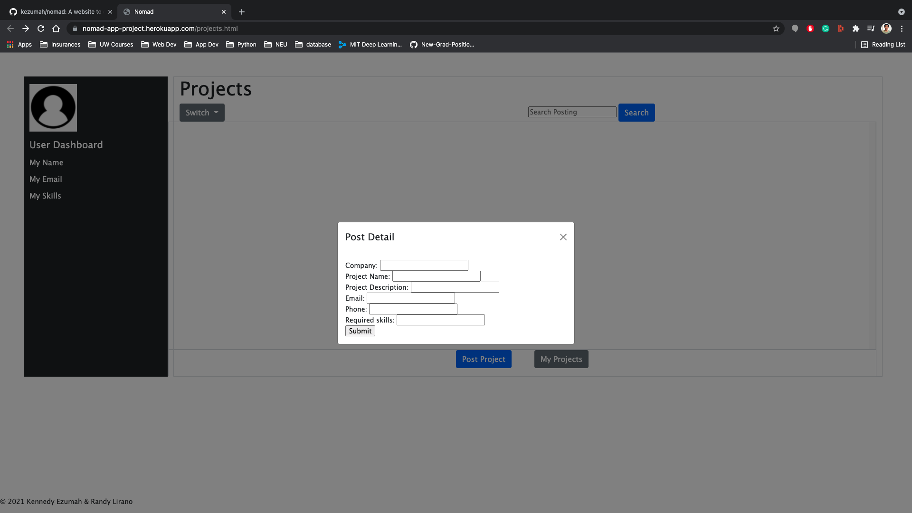
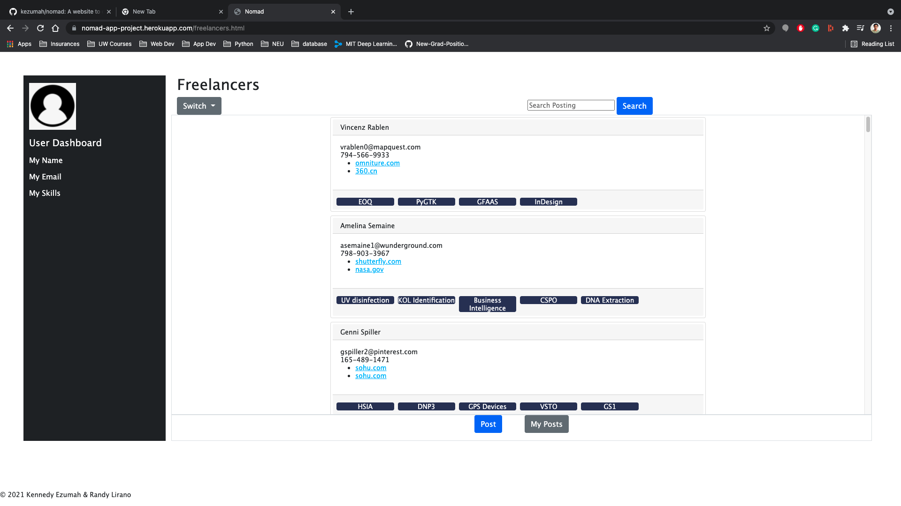
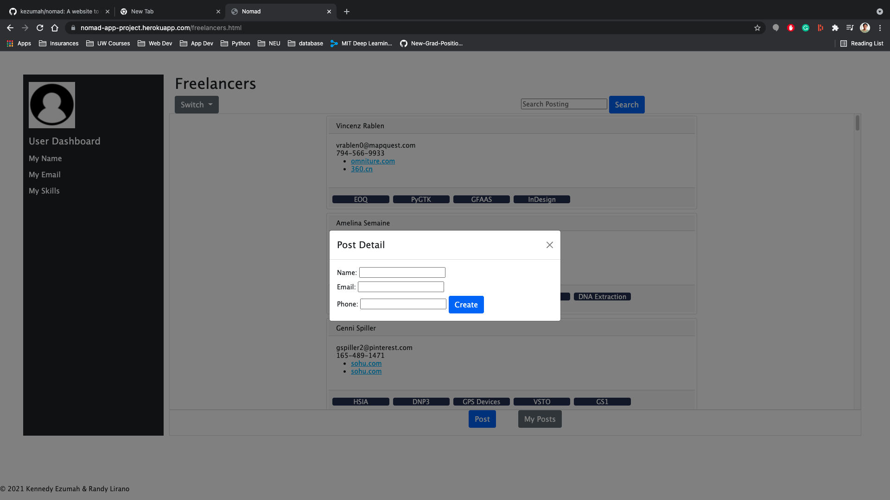
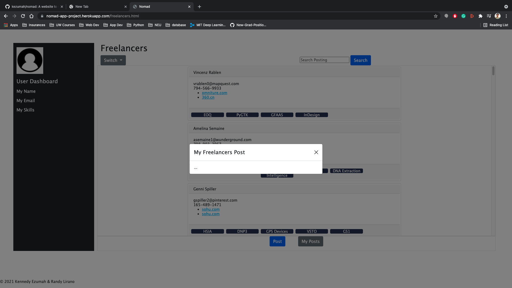

# nomad
A website to connect project owners with freelancers.

## Objective
This project is intended to focus on backend development using Node.js and Express. The database for the website was built using a non-relational database called Mongo DB. The database was hosted using MongoDB Atlas as our database server.

## Screenshots








## How-To-Use
There are 2 ways to use this project.
1. Visit our deployed application at Heroku. (link below)
2. Clone this git repository.

### Using our deployed version
Please visit our deployed application for the client version.

### Using locally via `git clone`
Once you clone our repository, make sure to install all dependencies.
Run the following command inside nomad root folder to install all dependencies: `npm install`

At the `db` folder, we have provided 2 JSON files to be used as a collection for the database.
1. Projects.json
2. Users.json

#### Creating local database
Before running the program we first need to create a local database.
Run the following command in your terminal to start local mongo server: `mongod --dbpath ~/data/db`
Keeping the local server running, open a new terminal and run the following to create nomadLocalDB database and import the given JSON files as collections:
1. Projects collection
```
mongoimport -h localhost:27017 -d nomadLocalDB -c Projects --drop --jsonArray --file ./db/Projects.json 
```
2. Users collection
```
mongoimport -h localhost:27017 -d nomadLocalDB -c Users --drop --jsonArray --file ./db/Users.json 
```
NOTE: In `./db/myMongoDB.js` make sure the global constant is saying `DB_NAME = "nomadLocalDB"`, otherwise the program cannot find the local database.

#### Running locally
Once the local database has been created, follow these steps to run locally:
1. Run Mongo server: `mongod --dbpath ~/data/db`
2. Run client server: `npm run devstart`
NOTE: the devstart script has been prepared to run the server using nodemone. If it cannot run, try running `npm start` instead.
3. Using your browser go to localhost: http://locahost:3000/

### Relevant Links
[Demo](https://nomad-app-project.herokuapp.com/)
[Video](https://youtu.be/aumBmPMepUE)
[Slides](https://docs.google.com/presentation/d/1BTYYXypbosWAm4gJ2Wu3WdDcv5MKs_HqppMUeoTTZis/edit?usp=sharing)
[Class](https://johnguerra.co/classes/webDevelopment_fall_2021/)
